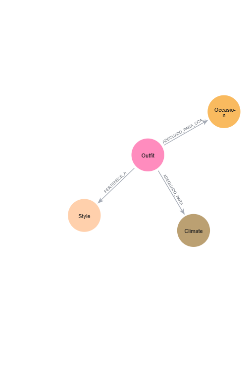

# Diseño de la Base de Datos



## Entidades
- **User**: `username`,`password`
- **Outfit**: `Name`, `upper`, `lower`, `footwear`, `Accesory`, `Id_image`
- **Climate**: `Name`,`Description`, `temp_min`,`temp_max`
- **Style**:`Name`,`Description`
- **Occasion**: `Name`, `Description`

### Relaciones  
- `(Outfit)-[:ADECUADO_PARA_OCASION]->(Ocasion)`: Indica para qué ocasión se diseñó el outfit.  
- `(Outfit)-[:ADECUADO_PARA]->(Climate)`: Indica para qué cliam es adecuado el outfit.
- `(Outfit)-[:PERTENECE_A]->(Style)`: Indica a que estilo pertenece el outfit.  

### Query. Ejemplo de comando utilizados

- **Crear nodo, ejemplo outfit**
```cypher
CREATE (o:Outfit {
  id: "0000",
  upper: "camisa",
  lower: "Pantalón",
  footwear: "Zapatos",
  Accesory: "gorra"
})
```

- **Crear una relación**
```cypher
MATCH (p:Nodo1 {Name: "000"})
MATCH (c:Nodo2 {Name: "000"}) 
CREATE (p)-[:Relacion]->(c);
```

- **Eliminar un nodo**
```cypher
MATCH (c:Nodo) WHERE c.Name IN ["Name"]
DELETE c
```  

- **Eliminar un nodo**
```cypher
MATCH (c:Nodo) WHERE c.Name IN ["Name"]
DELETE c
```     


- **Modificar parametro de un nodo**
```cypher
MATCH (o:Nodo {Name: "0000"})  
SET o.Parametro = "Prenda"     
RETURN o    
```     
